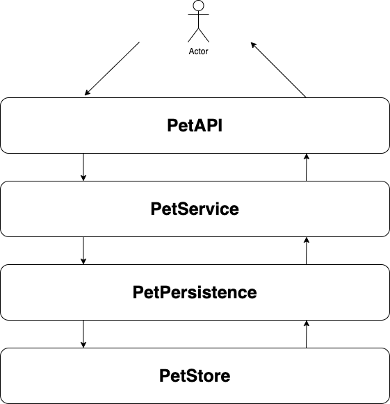
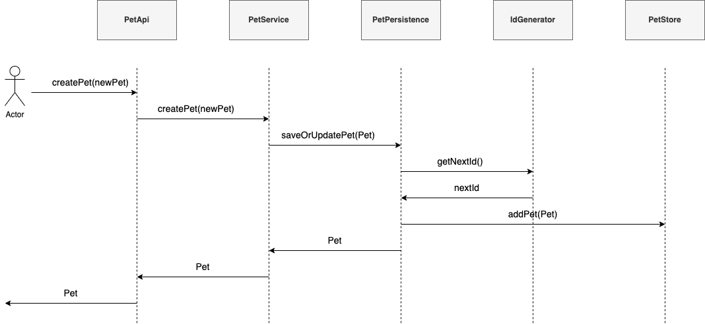

# Übungsaufgabe Petstore - Backend Developer Task


## Anforderung
Für die angegebene [OpenAPI Spec](openapi.yaml) soll ein Java-Backend erstellt werden.

## Architektur
Ich habe mich bei der Umsetzung für eine Schichten-Architektur entschieden, also aufeinander aufbauenden Diensten die nur direkt miteinander kommunizieren.
Ein Durchgreifen zwischen den Schichten ist nicht vorgesehen.

### Schichten


### Als Beispiel kann auch folgendes Sequenz-Diagramm zum Erstellen eines neuen Pets dienen  
  
  


## Umsetzung
* Voraussetzung: Java17
* Spring Boot v3.2.1 Projekt, mit zusätzlichen Abhängigkeiten zu Lombok und Spring-Validation und SpringDoc-Open Api.
* Daten werden nicht persistiert, nur In-Memory gehalten, sind also nach dem Neustart wieder weg
* Unit-Testabdeckung für alle Klassen vorhanden, evtl. könnten noch mehr Tests für Fehlerhandling geschrieben werden
* 1 Integration-Test für Happy-Path mittels SpringBootTest


## Starten des Projektes
```
git clone git@github.com:zaroselectro/agile-aim.git
bzw.
git clone  https://github.com/zaroselectro/agile-aim.git
cd agile-aim
mvn clean install
java -jar target/petstore-0.0.1-SNAPSHOT.jar
```


